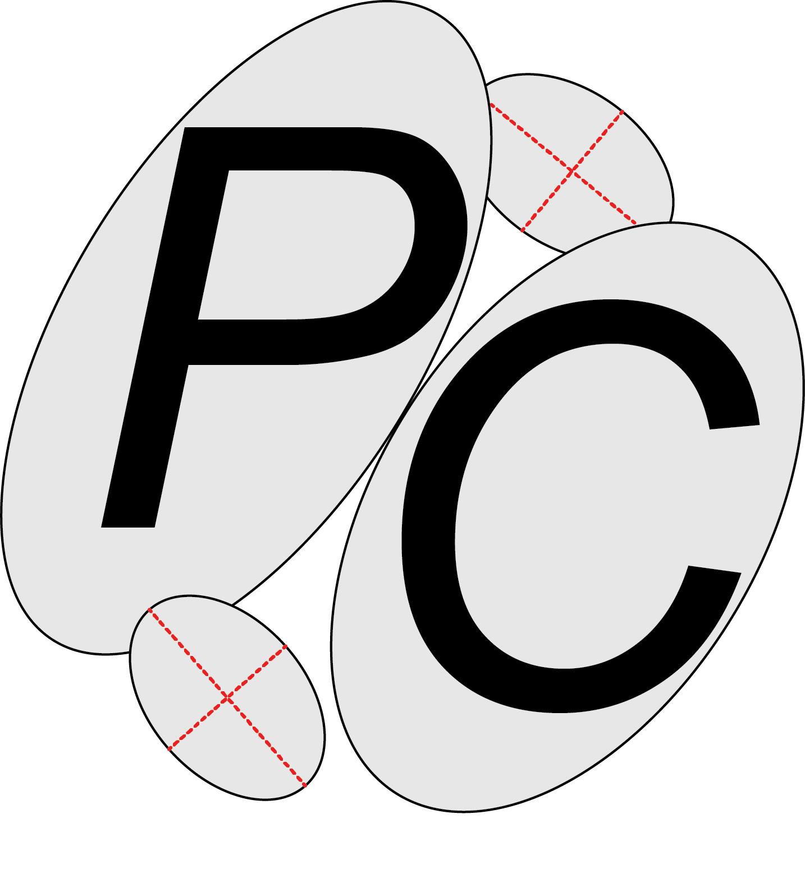
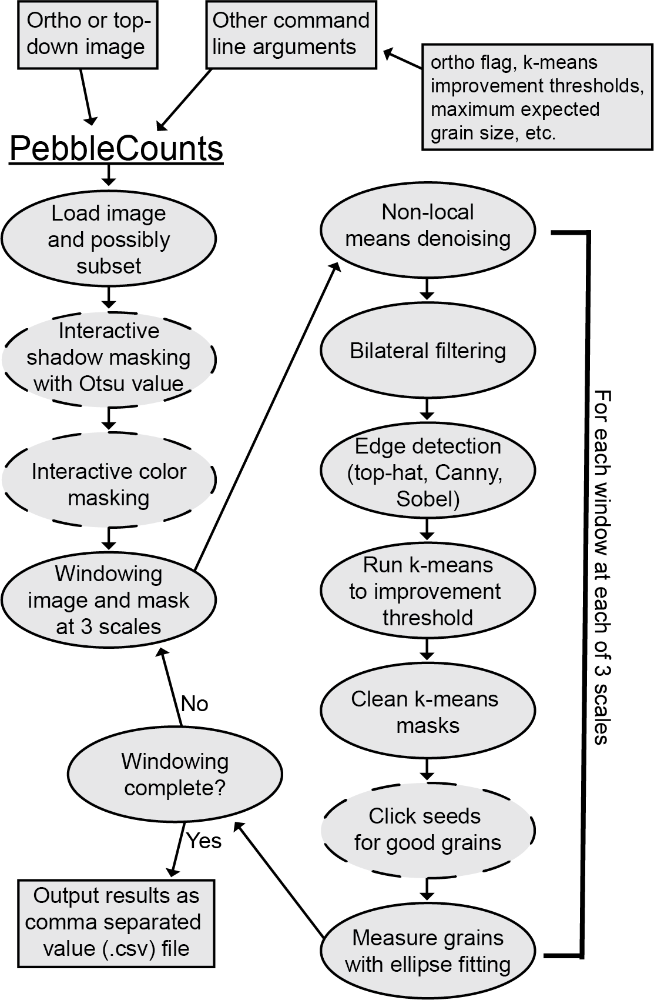

# Introduction to PebbleCounts
PebbleCounts is a Python based application for the identification and sizing of gravel from either orthorectified, georeferenced (**UTM projected**) images with known resolution or simple non-orthorectified images taken from directly overhead with the image resolution approximated by the camera parameters and shot height. Read about it (and cite it!) here: 

**PUBLICATION DOI TO BE ADDED**

Happy clicking!

[FULL MANUAL INCLUDING INSTALL AND RUNNING](docs/PebbleCounts_Manual.pdf)



# Software Citation
Purinton, Benjamin; Bookhagen, Bodo (2019): PebbleCounts: a Python grain-sizing algorithm for gravel-bed river imagery. V. 1.0. GFZ Data Services. http://doi.org/10.5880/fidgeo.2019.007

# License
GNU General Public License, Version 3, 29 June 2007

Copyright © 2019 Benjamin Piurinton, University of Potsdam, Potsdam, Germany

PebbleCounts is free software: you can redistribute it and/or modify it under the terms of the GNU General Public License as published by the Free Software Foundation, either version 3 of the License, or (at your option) any later version. PebbleCounts is distributed in the hope that it will be useful, but WITHOUT ANY WARRANTY; without even the implied warranty of MERCHANTABILITY or FITNESS FOR A PARTICULAR PURPOSE. See the GNU General Public License for more details. You should have received a copy of the GNU General Public License along with this program. If not, see http://www.gnu.org/licenses/.

## Disclaimer
PebbleCounts is a free (released under GNU General Public License v3.0) and open-source application written by a geologist / amateur programmer. If you have any problems contact me [purinton@uni-potsdam.de](purinton@uni-potsdam.de) and I can help!

# Quick note on imagery and running PebbleCounts
Georeferenced ortho-photos should be in a [**UTM projection**](https://en.wikipedia.org/wiki/Universal_Transverse_Mercator_coordinate_system), providing the scale in meters. You can use the [gdal](https://www.gdal.org/) command line utilities to [translate rasters between various projections](https://www.nceas.ucsb.edu/scicomp/recipes/gdal-reproject). Because PebbleCounts doesn't allow you to save work in the middle of clicking it's recommended that you don't use images covering areas of more than 2 by 2 meters or so. Furthermore, the algorithm is most effective on images of 0.8-1.2 mm/pixel resolution, where a lower cutoff of 10-pixels is appropriate. Resampling can also be accomplished quickly in [gdal](https://www.gdal.org/). For higher resolution (< 0.8 mm/pixel) imagery it's recommended not to go above 1 by 1 meter areas, particularly if there are many < 1 cm pebbles, and also to increase the lower cutoff (`-cutoff` flag) value to 25-pixels. If you want to cover a larger area simply break the image into smaller parts and process each individually, so you can give yourself a break. If at anytime you want to end the application simply press *CTRL + C*.

# Installation
The first step is downloading the GitHub repository somewhere on your computer. The folder should contain:
1. Three Python scripts: `PebbleCounts.py`, `PCfunctions.py`, `calculate_camera_resolution.py`
2. An `environment.yml` file containing the Python dependencies and a `install_openCV_env_ubuntu18.sh` shell script for creating an openCV environment with conda on Ubuntu
3. A folder `example_data` with two example images one orthorectified and the other raw
4. A folder `docs` containing the [full manual](docs/PebbleCounts_Manual.pdf)

## For the Pros
For those familiar with Python, the best way to install PebbleCounts is by simply downloading the GitHub repository, navigating to the PebbleCounts folder at the command line, ensuring all Python dependencies are installed (see the `environment.yml` file) and getting started by going through the [full manual](docs/PebbleCounts_Manual.pdf)

## For Newbies 
For newcomers to Python, no worries! Installation should be a cinch on most machines and I'll describe it here for Windows. First, you'll want the [Miniconda](https://conda.io/miniconda.html) Python package manager to setup a new Python environment for running the algorithm ([see this good article on Python package management](https://medium.freecodecamp.org/why-you-need-python-environments-and-how-to-manage-them-with-conda-85f155f4353c)). 

Download either the 32- or 64-bit installer of Python 3.x then follow the instructions. Add Miniconda to the system `PATH` variable when prompted. PebbleCounts has a number of important dependencies including [gdal](https://www.gdal.org/) for geo-referenced raster manipulation, [openCV](https://opencv.org/) for image manipulation and GUI operation, [scikit-image](https://scikit-image.org/) for filtering and measuring, [scikit-learn](https://scikit-learn.org/stable/) for k-means segmentation, along with a number of standard Python libraries including [numpy](http://www.numpy.org/), [scipy](https://www.scipy.org/), [matplotlib](https://matplotlib.org/), and [tkinter](https://wiki.python.org/moin/TkInter).

Once you've got `conda` commands installed, you can open a command-line terminal and create a conda environment with:
```
conda create --name pebblecounts python=3.6 opencv \
   scikit-image scikit-learn numpy gdal scipy matplotlib tk
```
Or just use the environment .yml file provided with:
```
conda env create -f environment.yml
```
and once installation is complete (and assuming no errors during the install) activate the new environment to run PebbleCounts by:
```
activate pebblecounts
```
Deactivate the environment to exit anytime by:
```
deactivate
```

## For Mac and Linux Users
Those using Mac OS or Linux shouldn't have much trouble modifying the above commands slightly (just add a leading `source` to the `activate` and `deactivate` commands above). Note that installing openCV and getting it to function properly can be a pain sometimes, especially in the case of Linux. In that case it is recommended to find some instructions for installing openCV's Python API for your specific Linux operating system [online](https://www.pyimagesearch.com/2018/05/28/ubuntu-18-04-how-to-install-opencv/). The shell script `install_openCV_env_ubuntu18.sh` should allow for a clean install of an openCV inclusive `pebblecounts` conda environment on an Ubuntu v.18 system.


# Overview
Briefly, PebbleCounts pre-processes the image by allowing the user to subset the full scene, then interactively masks shadows (interstices between grains) and color (for instance sand). Following this, PebbleCounts windows the scene at three different scales with the window size determined by the input resolution and expected maximum grain size provided by the user.

At each window the algorithm filters the image, detects edges, and employs [k-means segmentation](https://scikit-learn.org/stable/modules/clustering.html#k-means) to get an approximate cleaned-up mask of potential pebbles. The window is then shown with the mask overlain and the user is able to click the **good** looking grains and leave out the **bad** ones (see the [full manual](docs/PebbleCounts_Manual.pdf) for the step-by-step guide). These grains are then measured via ellipse fitting to retrieve the long- and short-axis and orientation. This process is iterated through each window and the output from the counting is provided as a comma separated value (.csv) file for user manipulation.

### Flowchart for PebbleCounts

